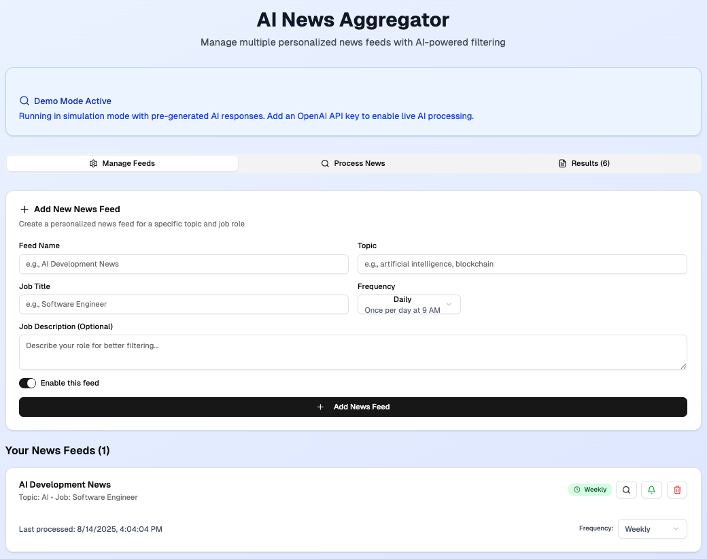
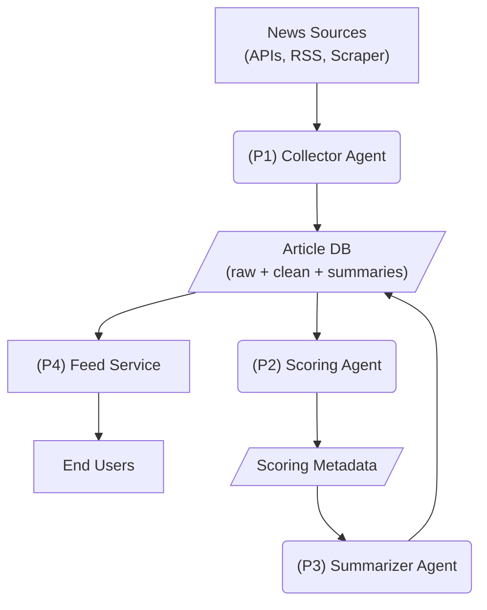

# News Aggregator

NOTE: The screenshot was generated using [Vercel v0](https://vercel.com/docs/v0) and it's not the final version.

**News Aggregator** is a personal Agentic AI-powered app that automatically collects news articles from multiple sources, scores them based on relevance to your interests, and generates summaries for quick reading. This project is designed for **personal use**, using **AWS serverless architecture** to minimize cost.

---

## Features
- Collects news from multiple sources (APIs, RSS feeds, web scraping)
- Scores articles based on your interests using OpenAI embeddings
- Generates summaries with GPT
- Personalized feed delivered through a React frontend
- Serverless backend using AWS Lambda and API Gateway
- Secure and cost-efficient using AWS free-tier services

---

## Architecture

**AWS Services:**
- **Frontend:** S3 + CloudFront
- **Backend:** AWS Lambda + API Gateway
- **Storage:** DynamoDB for article metadata and summaries
- **Automation:** EventBridge triggers scheduled Lambda executions
- **Authentication (optional):** Cognito
- **AI Processing:** OpenAI API (called from Lambda)

**Flow Diagram:**

